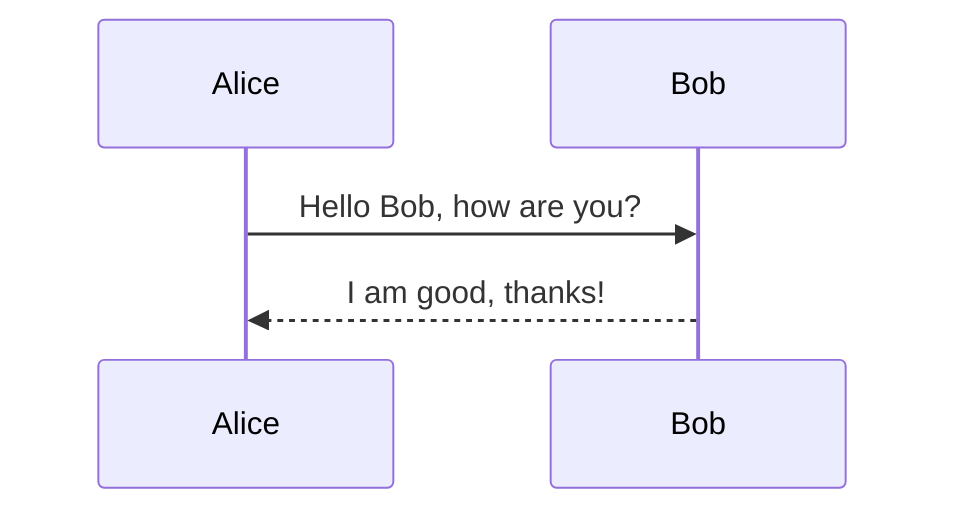

# test

| aaaa    | bbbb   | cccc    |
| ------- | ------ | ------- |
| aaaa    | bbbb   | cccc    |
| aaaa    | bbbb   | cccc    |
| aaaa    | bbbb   | cccc    |
| aaaa    | bbbb   | cccc    |
| aaaa    | bbbb   | cccc    |

| fdasf | fdsa | fds   |
|-------|------|-------|
| aa    | fdas | fdasf |
| fdsa  | jkl  | ffj   |
| fjjj  | jjjj | jjjj  |

```python
def hello_world():
    print("Hello, world!")

```

```json
{
  "key": "value",
  "number": 123,
  "array": [1, 2, 3]
}
```

```javascript
function greet() {
    console.log("Hello, world!");
}
```


